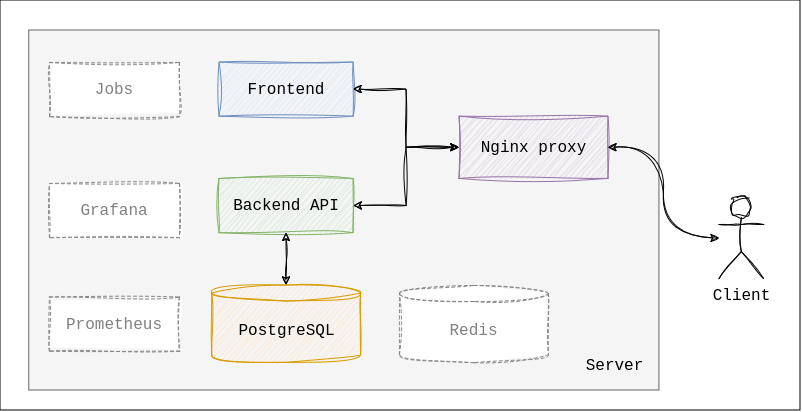
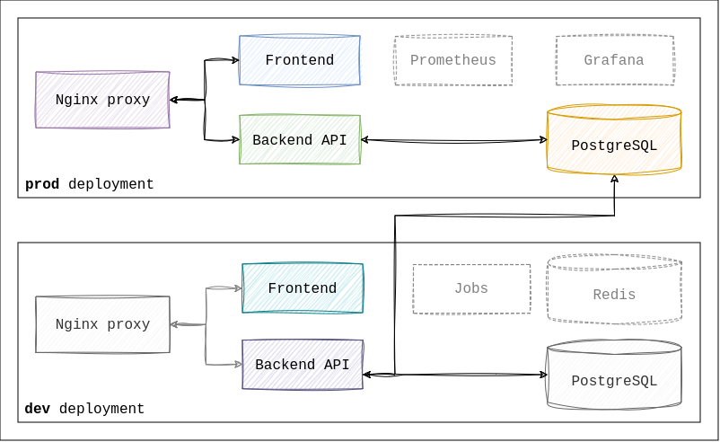
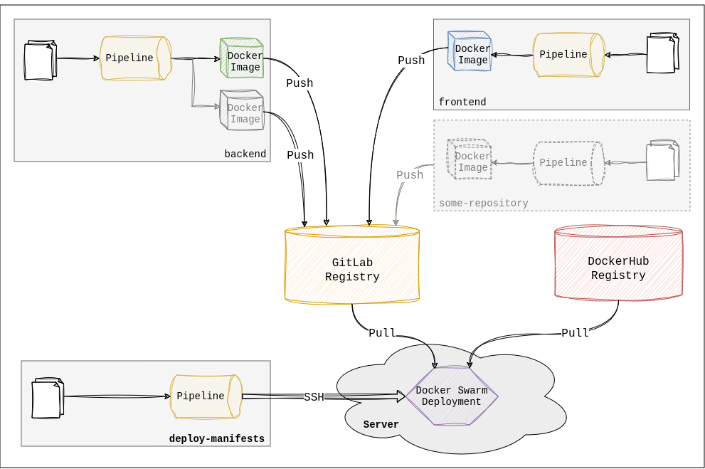
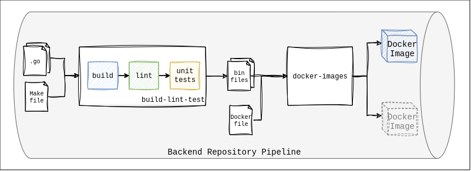
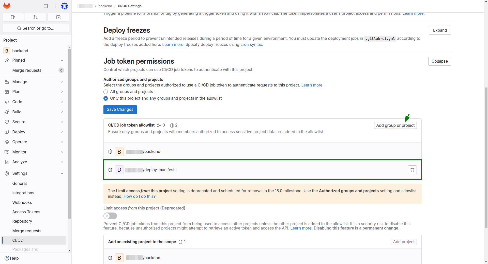
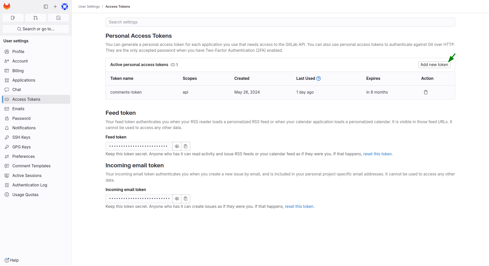
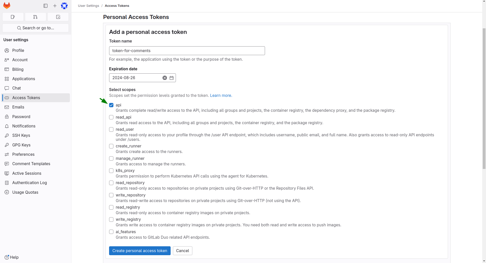
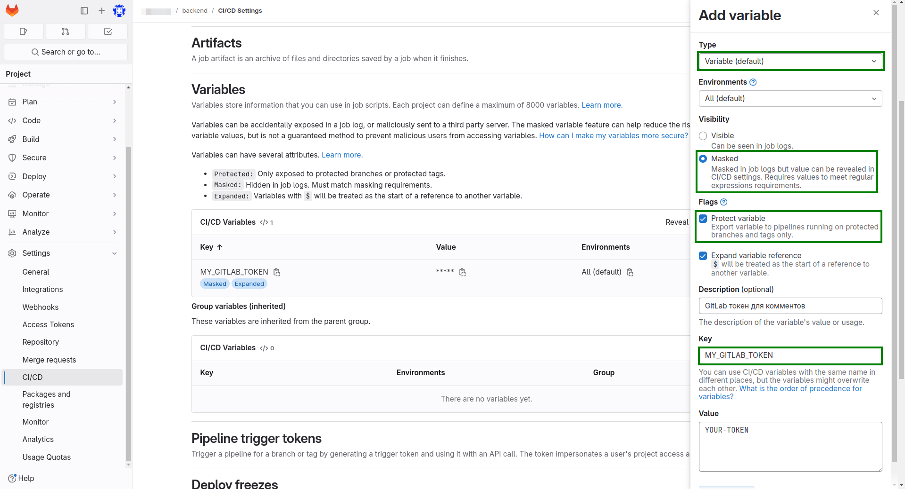
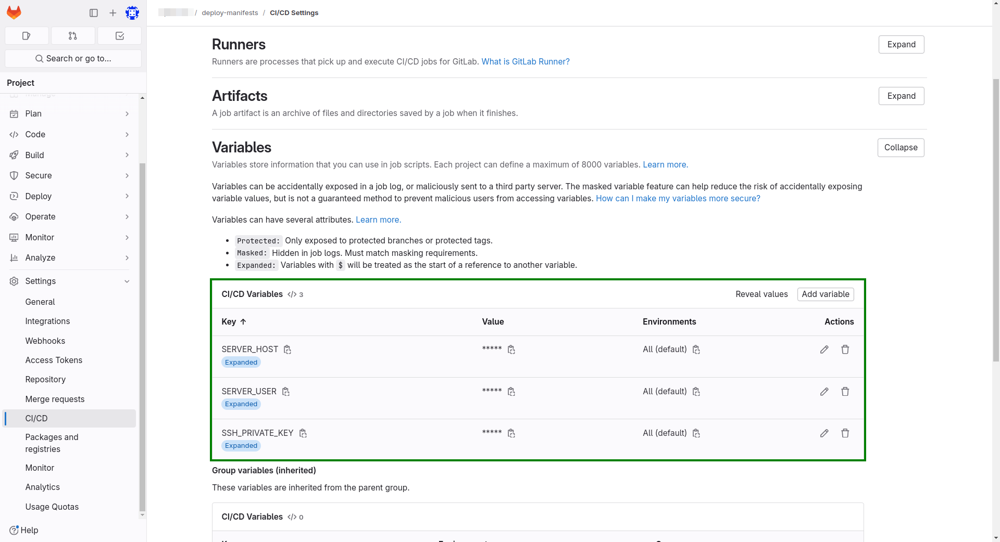
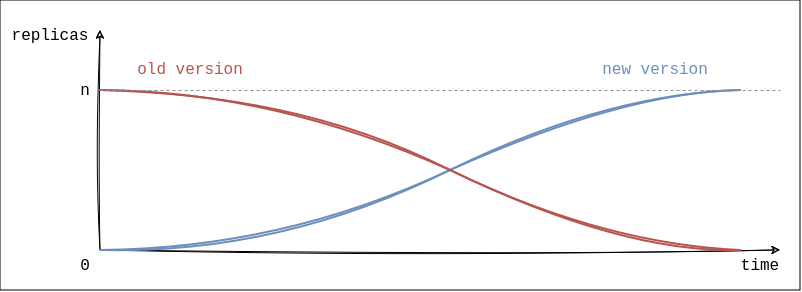

# Деплой в Docker Swarm


Недавно я занимался настройкой деплоя для одного из своих проектов. Хочу поделиться полученным опытом и знаниями в виде статьи, описывающей мою систему.

Расскажу:
- Как настроить пайплайны в **GitLab** для сборки и тестирования сервисов
- Как настроить **удаленный сервер** для развертывания сервисов
- Как автоматизировать **деплой** приложений **в Docker Swarm**, используя GitLab

Для понимания материала желательно:
- Уметь пользоваться Git и [GitLab](https://about.gitlab.com/), в т. ч. [GitLab Pipelines](https://docs.gitlab.com/ee/ci/pipelines/)
- Иметь базовые навыки использования Linux-утилит
- Понимать, что такое контейнеризация; знать, что такое [Docker](https://www.docker.com/)
- Иметь представление о том, как устроена архитектура современных web-приложений

**Дисклеймер**

**Эта схема не идеальна!** Она не подойдет для больших highload систем с сотнями сервисов. Однако в моём небольшом проекте она работает хорошо. Надеюсь, подойдёт и вам.

Я не считаю себя профессионалом в DevOps. Критикуйте, **предлагайте идеи и улучшения** в комментариях к этой статье, а так же в [Issues](https://github.com/Yu-Leo/deploy-to-docker-swarm/issues) и [Pull Requests](https://github.com/Yu-Leo/deploy-to-docker-swarm/pulls).

Репозиторий с исходными конфигами: https://github.com/Yu-Leo/deploy-to-docker-swarm

## Деплоим?

### Что деплоим?

Итак, для начала нужно определиться, что именно мы будем деплоить.

В текущей версии моя система состоит из 4-х компонентов:
- СУБД PostgreSQL
- Backend на Go
- Frontend на React + nginx в качестве веб-сервера
- Nginx proxy. Проксирует запросы от клиентов, распределяя их между backend и frontend. Обеспечивает поддержку протокола HTTP**S**

Помимо этих компонентов я планирую добавить и другие сервисы: систему сбора метрик (prometheus), мониторинга (grafana), in-memory хранилища (redis), вспомогательные джобы и т. д. и т. п.



### Куда деплоим?

Для развертывания системы я решил использовать **Docker-контейнеры**, а для их оркестрации — **[Docker Swarm](https://docs.docker.com/engine/swarm/)**. В [этой статье](https://habr.com/ru/articles/659813/)  описаны его основные возможности. Меня же в первую очередь привлекла простота его настройки и широкие возможности. То, что нужно для небольшого проекта.

В моём случае всё крутится на одном сервере, но Docker Swarm позволяет использовать несколько.

#### dev и prod окружения



Всю архитектуру я хочу разворачивать в **двух окружениях**: dev и prod.

`prod`:
- Боевое окружение (production)
- Единая точка входа для пользователей в виде nginx proxy
- Рабочие версии сервисов
- Продовые данные

`dev`:
- Тестовое окружение
- Несколько точек входа для разработчиков (backend, frontend, ...), если это необходимо
- Не всегда рабочие версии сервисов. Используется для тестов и экспериментов
- Тестовые данные

В текущей реализации и dev и prod окружения разворачиваются на одной manager-ноде Docker Swarm, но в разных [стеках](https://docs.docker.com/engine/swarm/stack-deploy/). По мере роста проекта эти окружения могут быть разделены на различные сервера или группы серверов.

### Как деплоим?

В качестве сервиса для хранения исходного кода проекта я выбрал **GitLab**. И, конечно, я хочу использовать его возможности **для автоматизации** сборки, тестирования и развертывания.

## Поехали!

Теперь реализуем систему для деплоя этого проекта.
### Схема



Все сервисы запускаются **в Docker-контейнерах**. А значит, нужны их образы (Docker Images). Публичные образы (например, nginx и postgresql) тянутся с Docker Hub. Приватные (backend, frontend) — с приватного GitLab Registry проекта.

Прежде чем спуллить образы с GitLab Registry их нужно туда запушить. Эта операция происходит в паплайнах репозиториев `backend` и `frontend`. В них хранятся исходники сервисов, а так же инструкции по сборке их Docker-образов. При необходимости в проект можно добавлять другие аналогичные репозитории.

Сердце этой системы развертывания — репозиторий `deploy-manifests` (на схеме слева внизу). Он содержит параметры запуска сервисов и их конфиги. Из его пайплайнов происходит всё взаимодействие с manager-нодой Docker Swarm.

### Тестирование и сборка

 Главная **цель** пайплайнов в репозиториях `backend` и `frontend`, ... — **собрать** из исходников **Docker-образ** сервиса(-ов). Попутно можно запускать тесты, линтеры и т. д.

#### Пайплайн в backend repository

**Структура репозитория**

[Репозиторий](https://github.com/Yu-Leo/deploy-to-docker-swarm/tree/main/backend)

```sh
.
├── backend  # Директория одного сервиса 
├── build  # Директория сборки
│   └── backend  # Исполняемый файл одного сервиса
│   └── build_version.tmp  # Временный файл с тегом
├── common  # Общий для нескольких сервисов код
├── Dockerfile  # Общий Dockerfile
├── .gitignore
├── .gitlab-ci.yml  # Описание GitLab Pipeline
├── .golangci.yml  # Конфиг для линтера
├── go.mod
├── go.sum
└── Makefile  # Файл с инструкциями по сборке и тестированию демонов
```

По структуре это **монорепозиторией**: в одном репозитории хранится код нескольких микросервисов. У этого подхода есть свои плюсы и минусы, но их рассмотрение выходит за рамки этой статьи.

**Сборка**

[`.gitlab-ci.yml`](https://github.com/Yu-Leo/deploy-to-docker-swarm/blob/main/backend/.gitlab-ci.yml)



Пайплайн состоит из двух джоб:
- `build-lint-test`
- `docker-images`

В `build-lint-test`, как следует из названия, происходят три действия: **сборка** исполняемого файла, запуск **линтера** и запуск **юнит-тестов**. Если на оном из этапов джоба падает, пайплайн дальше не идёт. Если же все этапы выполнились успешно, в GitLab сохраняется артефакт работы джобы — набор исполняемых файлов для каждого микросервиса (демона).

В джобе `docker-images` происходит **сборка Docker-образов** демонов на основе исполняемых файлов, а так же Dockerfile. После сборки полученные образы пушатся в GitLab Registry. Каждый образ получает уникальный тег, состоящий из даты и 8-ми цифр от хэш-суммы коммита (`20240725_4605cc6e`).

Я учел, что разным микросервисам могут понадобиться **разные Dockerfile** для сборки. Если в директории микросервиса есть Dockerfile, образ будет собираться по нему. Иначе будет использован [дефолтный Dockerfile](https://github.com/Yu-Leo/deploy-to-docker-swarm/blob/main/backend/Dockerfile), расположенный в корне репозитория.

**Правила запуска джоб**

В моей реализации триггером запуска джоб являются **лейблы на MR в GitLab**.

- Лейбл `tests` запускает только джобу `build-lint-test`
- Лейбл `build-<service-name>`, где `<service-name>` — название микросервиса, запускает обе джобы: `build-lint-test` и `docker-images`. Build и push операции будут выполняться только для сервиса `<service-name>`. Если указать несколько: `build-<service-name-1>`, `build-<service-name-2>`, будут собраны и запушены все соответствующие образы.

Джобу `build-lint-test` можно также запустить вручную, без каких либо лейблов.

#### Пайплайны в других репозиториях

Аналогичным образом можно настроить пайплайны в других репозиториях.

В качестве примера — мой репозиторий [frontend](https://github.com/Yu-Leo/deploy-to-docker-swarm/tree/main/frontend). Его пайплайн состоит из единственной джобы, которая собирает и публикует Docker-образ.

**Важно!** В настройках каждого подключаемого репозитория необходимо дать доступ до скачивания образов из пайплайнов репозтория `deploy-manifests`:



Фактически скачивание будет происходить не в самом пайплайне, а на удаленном сервере при развертывании, но для доступа в приватный GitLab Registry используется токен из GitLab Job-ы.

#### Комментариями с тегами образов

Каждый образ собирается и пушится с уникальным тегом (пример: `20240722_ac34b89g`). Далее этот тег понадобится нам для деплоя конкретной версии сервиса.

Чтобы не искать сгенерированный тег вручную, я настроил их **автоматическую публикацию** в комментарии к MR.

**Как это выглядит**

Сообщение об успешной сборке образа сервиса `ping`:


Сообщение о фейле сборки и/или публикации образа:


**Как это настроить**

В файле [.gitlab-ci.yaml](https://github.com/Yu-Leo/deploy-to-docker-swarm/blob/main/backend/.gitlab-ci.yml#L77)

Эта фишка реализована при помощи [GitLab API](https://docs.gitlab.com/ee/api/rest/). Для его использования необходимо **получить токен** доступа.

В GitLab Free недоступны токены для джоб, но вместо них можно использовать токен от персонального аккаунта. Строго говоря, этот способ **не безопасен**, однако имеет место быть для небольших проектов. При этом комментарии будут публиковаться от имени владельца токена.

Чтобы это повторить, нужно:

1. Добавить ещё один токен для своего аккаунта



2. Указать этот токен в ENV-переменной для пайплайна в репозитории






После этого станет доступна публикация комментариев к MR в репозитории.

### Сервер

#### Подготовка

**Описание** даже базовой **настройки удаленно сервера** получилось объемным, поэтому я вынес его в отдельную статью: "[Настройка SSH на удаленном сервере](https://yu-leo.github.io/yu0dev/posts/setup-ssh-on-server/)". Рекомендую прочесть её, прежде чем переходить далее.

#### Пользователь `gitlab`

Помимо основного пользователя `www`, которого мы создавали в вышеупомянутой статье, нужно завести пользователя `gitlab`. От его имени в джобах GitLab-пайплайна будет происходить подключение к серверу.

1. Создаем пользователя (на сервере)

```shell
useradd -s /bin/bash -m gitlab
```

2. Создаем ключи (на локальной машине)

```shell
ssh-keygen -t ed25519
mv id_ed25519.pub gitlab.pub
mv id_ed25519 gitab
```

Пароль от приватного SSH-ключа задавать **не** нужно.

3. Редактируем файл `/etc/ssh/sshd_config` (на сервере)

```sh
PasswordAuthentication yes  # Временно разрешаем авторизацию по паролю
AllowUsers www gitlab  # Добавляем пользователя gitlab
```

4. Закидываем **публичный** ключ с локальной машины на сервер

```shell
ssh-copy-id -i ~/.ssh/gitlab.pub gitlab@<ip>
```

5. Редактируем файл `/etc/ssh/sshd_config` (на сервере)

```sh
PasswordAuthentication no  # Закрываем обратно
```

6. Добавляем пользователя `gitlab` в группу `docker` (на сервере)

```shell
sudo usermod -aG docker gitlab
```

#### Docker Swarm

[Инициализируем](https://docs.docker.com/reference/cli/docker/swarm/init/) Docker Swarm командой

```shell
docker swarm init
```

Далее появится сообщение

```
Swarm initialized: current node (bvz81updecsj6wjz393c09vti) is now a manager.

To add a worker to this swarm, run the following command:

    docker swarm join --token SWMTKN-1-3pu6hszjas19xyp7ghgosyx9k8atbfcr8p2is99znpy26u2lkl-1awxwuwd3z9j1z3puu7rcgdbx 172.17.0.2:2377

To add a manager to this swarm, run 'docker swarm join-token manager' and follow the instructions.
```

в котором Docker сообщает, что текущая нода будет являться manager-нодой, и показывает, каким образом можно добавить worker-ноды в кластер.

Для деплоя необязательно иметь worker-ноды. Можно использовать единственную manager-ноду и разворачиваться на ней.

#### Структура директорий на сервере

```sh
.  # /
├── ...
└── data 
    └── PROJECT-NAME  # Название проекта
        ├── data  # Данные сервисов
        │   └── prod  # Данные prod-сервисов
        │       ├── nginx-proxy
        │       │   └── ssl
        │       │       ├── ca.crt
        │       │       ├── hostname.crt
        │       │       └── hostname.key
        │       └── postgres
        └── deploy  # Данные деплоя
            ├── dev  # Конфиги dev-сервисов
            │   └── backend
            │       └── config.toml
            ├── docker-compose.dev.yaml
            ├── docker-compose.prod.yaml
            ├── get-config-versions.py
            └── prod  # Конфиги prod-сервисов
                ├── nginx
                │   └── default.conf
                ├── nginx-proxy
                │   └── default.conf
                └── backend
                    └── config.toml
```

Для корректной работы нужно вручную создать часть директорий перед запуском развертывания:

```shell
mkdir -p /data/PROJECT-NAME/data/prod/postgres
mkdir -p /data/PROJECT-NAME/data/prod/nginx-proxy
mkdir -p /data/PROJECT-NAME/deploy
```

При необходимости структуру можно поменять, не забыв обновить пути в файлах репозитория `deploy-manifests`.

#### Docker Secrets

[Docker Secrets](https://docs.docker.com/engine/swarm/secrets/) — механизм Docker для управления **приватными** данными (секретами). Типичные примеры секретов: пароли, ключи, сертификаты. Секреты монтируются к Docker-контейнерам: содержимое секрета находится в файле `/run/secrets/secret-name` внутри контейнера. Ниже я опишу их использование подробнее.

Рассмотрим создание секретов на примере двух кейсов:

**1. Пароль для пользователя в PostgreSQL**

Автоматически сгенерируем 32-х символьный пароль для юзера PostgreSQL и запишем его в Docker Secret с названием `postgres-passwd`:

```shell
tr -dc A-Za-z0-9 </dev/urandom | head -c 32 | docker secret create postgres-passwd
```

а можно сгенерировать пароль, после чего одновременно вывести его в терминал и записать в Docker Secret:

```shell
tr -dc A-Za-z0-9 </dev/urandom | head -c 32 | tee /dev/stderr | docker secret create postgres-passwd
```

**2. Сертификат для nginx**

Ситуация: на локальной машине наличествует в наличии файл с SSL-сертивикатом для nginx. Нужно закинуть его в Docker Secret на удалённом сервере, чтобы в дальнейшем использовать в nginx.

Копируем файл на удаленный сервер:

```shell
scp /path/to/file/on/local usename@servername:/path/to/file/on/server
```

Кладем содержимое файла в Docker Secret командой:

```shell
cat /path/to/file/on/server | docker secret create nginx-crt -
```

### deploy-manifests

Перейдём к главному компоненту моей системы развертывания — репозиторию `deploy-manifests`. Из его пайплайнов происходит запуск сервисов в Docker Swarm.

#### Структура репозитория

```sh
.
├── copy-files.sh  # Файл, копирующий содержимое из репозитория на сервер
├── deploy.sh  # Файл с инструкциями по развертыванию системы
├── dev  # Конфиги для dev-окружения
│   └── backend  # Конфиги сервиса backend в dev-окружении
│       └── config.toml
├── docker-compose.dev.yaml  # Описание стека dev-окружения
├── docker-compose.prod.yaml  # Описание стека prod-окружения
├── get-config-versions.py  # Файл, генерирующий версии конфигов
├── .gitignore
├── .gitlab-ci.yml  # Описание GitLab Pipeline
├── prod  # Конфиги для prod-окружения
│   ├── backend  # Конфиги сервиса backend в prod-окружении
│   │   └── config.toml
│   └── nginx-proxy  # Конфиги сервиса nginx-proxy в prod-окружении
│       └── default.conf
└── requirements.txt  # Зависимости для скипта get-config-versions.py
```

#### Подключение к серверу

Для подключения к удаленному серверу из джоб пайплайна необходимо **указать** следующие **ENV-переменные** в настройках репозитория:
- `SERVER_HOST` — ip-адрес manager-ноды Docker Swarm
- `USER_NAME` — пользователь на удаленном сервере, от имени которого будет происходить деплой. Как его создать я описывал выше, в разделе "Сервер" -> "Пользователь gitlab"
- `SSH_KEY` — приватный ssh-ключ для вышеупомянутого пользователя



#### Пайплайн

[`.gitlab-ci.yaml`](https://github.com/Yu-Leo/deploy-to-docker-swarm/blob/main/deploy-manifests/.gitlab-ci.yml)

Пайплайн состоит из двух независимых джоб: `dev-deploy` и `prod-deploy`. Как следует из названия, каждая из них **запускает деплой** соответствующего **окружения**. Обе джобы имеют одинаковую логику; отличаются только окружениями

Суть каждой джобы сводится к двум действиям:
1. **Скорпировать** на удаленный сервер **файлы** из репозитория. При этом копируются конфиги только соответствующего джобе окружения
2. **Запустить** на удалённом сервере **скрипт** `deploy.sh` для развертывания стека сервисов. О нем подробнее далее
#### docker-compose.mode.yml

Это файл, в котором задается **конфигурация для деплоя** соответствующего `mode` стека сервисов: `dev` либо `prod`. Если вы уже работали с docker-compose, его структура вам знакома, однако для использования в режиме Docker Swarm есть дополнительные настройки.

**Описание [`docker-compose.prod.yml`](https://github.com/Yu-Leo/deploy-to-docker-swarm/blob/main/deploy-manifests/docker-compose.prod.yaml):**

На самом верхнем уровне `docker-compose.mode.yml` состоит из нескольких секций:
- `services:` — сервисы, входящие в стек
- `networks:` — связывающие их сети
- `configs:` — [Docker-конфиги](https://docs.docker.com/reference/cli/docker/config/)
- `secrets:` — [Docker-секреты](https://docs.docker.com/reference/cli/docker/secret/)

**Services**

Блок, в котором описывается набор сервисов, входящих в стек. В качестве примера рассмотрим базовые настройки сервиса [`backend`](https://github.com/Yu-Leo/deploy-to-docker-swarm/blob/main/deploy-manifests/docker-compose.prod.yaml#L40):

```yaml
services:
  # ...
  backend:
    hostname: backend
    image: ${REGISTRY}/PROJECT-NAME/backend/backend:20240727_a5fa34c7
    environment:
      DB_PASS_FILE: /run/secrets/project-prod-postgres-passwd
    depends_on:
      - postgres
```

- `hostname` — имя сервиса во внутренней сети Docker-стека
- `image: ${REGISTRY}/PROJECT-NAME/backend/backend:20240727_a5fa34c7` — путь до образа сервиса. После двоеточия указывается тег.
- `environment` — описание переменных окружения
- `depends_on` — зависимости между сервисами. `backend` будет запущен после сервиса `postgres`

**Configs**

```yaml
services:
  # ...
  backend:  
    # ...
    configs:  
      - source: backend-config  
        target: /app/config.toml
	# ...
configs:  
  backend-config:  
    name: ${PROJECT_PROD_BACKEND_CONFIG}
    file: ./prod/backend/config.toml
```

Docker-конфиги — файлы, хранящие в себе **нечувствительную** информацию. Не подходят для хранения паролей и сертификатов, но подходят (как и следует из названия) для хранения конфигов.

Docker не умеет автоматически обновлять сервис, если конфиг изменился. Для решения этой проблемы придумано несколько решений; я расскажу о своём.

Каждому конфигу, описанному в глобальной секции `configs:` docker-compose файла, присваивается имя (`name:`). Его значение берётся из переменной окружения (`${PROJECT_PROD_BACKEND_CONFIG}`).

Каждый раз при запуске скрипта [deploy.sh](https://github.com/Yu-Leo/deploy-to-docker-swarm/blob/main/deploy-manifests/deploy.sh) (о нём подробнее далее) значения этих переменных инициализируются:
1. Запускается скрипт [`get-config-versions.py`](https://github.com/Yu-Leo/deploy-to-docker-swarm/blob/main/deploy-manifests/get-config-versions.py) . Результатом его работы являются строки вида `PROJECT_PROD_BACKEND_CONFIG=md5(config-file)`, где `md5(config-file)` — часть хэша от содержимого файла с конфигом. Путь до файла берётся из поля `file:` docker-compose файла.
2. В скрипте deploy.sh на основе полученных строк [инициализируются переменные окружения](https://github.com/Yu-Leo/deploy-to-docker-swarm/blob/main/deploy-manifests/deploy.sh#L27).

Как это влияет на работу сервисов:

- Конфиг не изменился => не изменился его хэш => не изменилось имя Docker-конфига => Docker не будет обновлять сервис => сервис продолжит работу со своим конфигом
- Конфиг изменился => изменился его хэш => изменилось имя Docker-конфига => Docker будет обновлять сервис => после обновления сервис будет использовать новый конфиг

Описание настроек из docker-compose файла:

- `source: backend-config` — название Docker-конфига, который нужно подключить к сервису
- `target: /app/config.toml` — путь, по которому конфиг будет расположен в контейнере сервиса
- `name: ${PROJECT_PROD_BACKEND_CONFIG}` — имя Docker-конфига
- `file: ./prod/backend/config.toml` — путь до конфига на manager-ноде

Для работы скрипта `get-config-versions.py` требуется установить [зависимости](https://github.com/Yu-Leo/deploy-to-docker-swarm/blob/main/deploy-manifests/requirements.txt) (на сервере):

```shell
pip3 install -r ./requirements.txt
```

**Secrets**

```yaml
services:
  # ...
  backend:  
    # ...
    secrets:  
      - project-prod-postgres-passwd
	# ...
secrets:  
  project-prod-postgres-passwd:  
    external: true
```

Как я уже говорил, Docker-секреты — это файлы, хранящие в себе **чувствительную** информацию: пароли, ключи и т. п.

`external: true` указывает, что Docker-секрет заранее создан в Docker Swarm. Выше я описывал процесс создания Docker-секретов на сервере

Файлы с Docker-секретами будут примонтированы в директорию `/run/secrets/` внутри контейнера с сервисом. Описанный выше секрет `project-prod-postgres-passwd` расположится в файле `/run/secrets/project-prod-postgres-passwd`.

[Официальная документация](https://docs.docker.com/compose/compose-file/05-services/#secrets)

**Healthcheck**

```yaml
services:
  # ...
  backend:  
    # ...
    healthcheck:  
      test: curl --fail http://127.0.0.1:8080/api/service/ping || exit 1
      interval: 10s
      timeout: 3s  
      retries: 5
```

Проверяет работоспособность каждой реплики сервиса.
- `test:` — команда, которая будет выполняться в контейнере. Если она завершится с кодом `0` — сервис жив и готов к работе, если c кодом `1` — сервис нездоров. В примере: стучимся на ручку `ping` сервиса; если она не отвечает, сервис не проходит healthcheck
- `interval:` — интервал проверки
- `timeout:` — таймаут на выполнение хелсчек-команды
- `retries:` — сколько раз проверка должна упасть — вернуть ненулевой код ошибки — прежде чем на контейнер будет признан unhealthy

[Официальная документация](https://docs.docker.com/compose/compose-file/05-services/#healthcheck)

**Deploy**

```yaml
services:
  # ...
  backend:  
    # ...
    deploy:  
      replicas: 1  
      restart_policy:  
        delay: 5s  
        condition: on-failure  
      update_config:  
        parallelism: 1  
        order: start-first  
        failure_action: rollback  
        delay: 10s  
      rollback_config:  
        parallelism: 0  
        order: stop-first  
      resources:  
        limits:  
          cpus: "0.7"  
          memory: "800M"
```

Секция, в которой описываются параметры, относящиеся к развертыванию сервиса. Разберём подробнее.

[Официальная документация](https://docs.docker.com/compose/compose-file/05-services/#deploy)

**RollingUpdate**

```yaml
services:
  # ...
  backend:  
    # ...
    deploy:  
      update_config:  
      	parallelism: 1  
      	order: start-first  
        failure_action: rollback  
      	delay: 10s  
      rollback_config:  
	      parallelism: 0  
	      order: stop-first
```

Плавная выкатка. Механизм, при помощи которого можно **постепенно** обновить сервис с одной версии на другую.

Конфигурация, приведённая выше, описывает следующее поведение: 
1. Поднимается **одна реплика новой версии**, при этом остаются все реплики старой версии.
2. После того как реплика успешно поднялась и helthcheck-проверка успешно прошла, выключается **одна реплика старой версии**.
3. Пункты 1 и 2 повторяются, пока не будут **обновлены все реплики**
4. Если в какой-то момент раскатка прервётся, все новые реплики разом остановятся и будут подняты реплики старой версии.



Чтобы проверить и наглядно показать работу этой функции я написал небольшой скрипт. Каждую секунду он посылает запрос на ручку `/api/service/version` моего сервиса, поле чего выводит ответ.

```sh
while true; do echo -n "$(date) "; curl -sS http://SERVER_ADDRES:8080/api/service/version; echo ''; sleep 1; done
```

Далее я запустил этот скрипт на локальной машине параллельно с запуском выкатки новой версии сервиса. Результат:

```
Ср 17 июл 2024 21:52:08 MSK {"name":"backend","version":"20240704_63586a62"}
Ср 17 июл 2024 21:52:09 MSK {"name":"backend","version":"20240704_63586a62"}
Ср 17 июл 2024 21:52:10 MSK {"name":"backend","version":"20240717_8a4f53ae"}
Ср 17 июл 2024 21:52:11 MSK {"name":"backend","version":"20240704_63586a62"}
Ср 17 июл 2024 21:52:12 MSK {"name":"backend","version":"20240717_8a4f53ae"}
Ср 17 июл 2024 21:52:13 MSK {"name":"backend","version":"20240717_8a4f53ae"}
```

Сначала все запросы попадали на поды со старой версией сервиса (`20240704_63586a62`), затем один запрос попал на новую (`20240717_8a4f53ae`) и одни на старую, после чего все запросы стали попадать только на новую версию сервиса.

Это объясняется тем, что во время раскатки нового сервиса в некоторый момент времени существовали одновременно поды старой и новой версии. Docker автоматически распределяет запросы между подами, поэтому часть запросов попала на новую версию, часть — на старую. По завершении процесса раскатки подов со старой версией не осталось и все запросы стали приходить только на поды с новой версией.

Если во время раскатки поды не будут проходить helthcheck-проверки, произойдет rollback, то есть автоматический откат до старой версии. В таком случае в логах GitLab джобы появится сообщение:

```
rollback: update rolled back due to failure or early termination of task y4skuy8si13qy1hrzui7inzcn
```

Этот лог можно обработать и вывести алерт о произошедшем откате.

[Официальная документация по update_config](https://docs.docker.com/compose/compose-file/deploy/#update_config)

[Официальная документация по rollback_config](https://docs.docker.com/compose/compose-file/deploy/#rollback_config)

**Resources**

```yaml
services:
  # ...
  backend:  
    # ...
    deploy:
      resources:  
        limits:  
          cpus: "0.7"  
      	  memory: "800M"
```

В этой секции задаются требования и лимиты по CPU и оперативной памяти. Подробнее — в [официальной документации](https://docs.docker.com/compose/compose-file/deploy/#resources).

**Volumes**

[Docker Volume](https://docs.docker.com/engine/storage/volumes/) — механизм, позволяющий расшарить данные (файлы, директории) между контейнерами и хостовой машиной. Преимущество использования Docker Volumes состоит в том, что после остановки или удаления контейнера данные остаются на хостовой ОС. Это можно использовать для хранения файлов БД и подключения их в контейнер с СУБД:

```yaml
services:  
  postgres:  
    # ... 
    volumes:  
      - /data/PROJECT-NAME/data/prod/postgres:/var/lib/postgresql/data
```

Директория `/data/PROJECT-NAME/data/prod/postgres` на хостовой ОС будет соответствовать директории `/var/lib/postgresql/data` внутри Docker-контейнера. Таким образом все изменения, которые PostgreSQL производит внутри контейнера, будут сохраняться и на хостовой ОС. Если контейнер остановится, данные не потеряются.

#### Правила запуска пайплайна

Есть 3 триггера для запуска джоб деплоя
- Лейблы на MR. Лейбл `dev-deploy` триггерит джобы деплоя dev-окружения, `prod-deploy` — prod-окружения. Лейблы не зависят друг от друга.
- Запуск в MR вручную. Любую джобу можно независимо запустить из любого MR
- Merge в main-ветку. При мердже в main-ветку автоматически запускается джоба `prod-deploy`. `dev-deploy` не запускается, поскольку иногда полезно оставить в dev-среде то состояние, которое было развернуто с ещё не смердженного MR

#### deploy.sh

Описание файла [`deploy.sh`](https://github.com/Yu-Leo/deploy-to-docker-swarm/blob/main/deploy-manifests/deploy.sh).

Этот скрипт запускается на удаленном сервере и обновляет сервисы соответствующего окружения (`--dev` или `--prod` при запуске).

Процесс обновления окружения состоит из нескольких этапов:

1. Подготовительный этап №1: **определение режима запуска** скрипта (`dev` или `prod`). Переход в рабочую директорию.

2. Подготовительный этап №2: **обновление конфигов**. Как я уже говорил, Docker не умеет в автоматичекое обновление конфигов, поэтому эту проблему нужно решить самостоятельно (см. раздел "docker-compose.mode.yml" -> "configs"). На этом этапе запускается скрипт [`get-config-versions.py`](https://github.com/Yu-Leo/deploy-to-docker-swarm/blob/main/deploy-manifests/get-config-versions.py) и инициализируются сгенерированные им переменные окружения.

3. Основной этап: **обновление деплоймента** средствами Docker Swarm. Здесь стоит упомянуть, что Docker Swarm умный: он не будет убивать контейнеры и поднимать новые, если у сервиса не изменился конфиг, тег или параметры в `docker-compose.mode.yml`

4. Заключительный этап: **очистка неиспользуемых объектов** Docker. В том числе удаление лишних конфигов: в скрипте запускается команда на удаление всех конфигов; Docker знает, какие из них ещё используются, и удаляет только неиспользуемые

## Итоги

Исходники: https://github.com/Yu-Leo/deploy-to-docker-swarm

Вот такая система для развертывания сервисов у меня получилась. Повторюсь: она далека от идеала, однако имеет право на жизнь и использование в небольших проектах.

### А что дальше?

Бесконечный простор для творчества. Можно улучшать и добавлять новую функциональность как пайпалайнам сборки, так и пайплайну деплоя.

Вот несколько идей, которые я собираюсь реализовать в своей системе:
- end-2-end тестирование. Поднятие полноценного тестового окружения в пайплайне репозитория backend, запуск e2e-тестов в пайплайне
- Добавление системы метрик, графиков и алертов
- Добавление системы сбора, фильтрации и отображения логов и ошибок
- Улучшения системы оповещения о сбоях в процессе деплоя

Предлагайте свои идеи улучшений в комментариях, а так же в [Issues](https://github.com/Yu-Leo/deploy-to-docker-swarm/issues) и [Pull Requests](https://github.com/Yu-Leo/deploy-to-docker-swarm/pulls) в репозитории!


---

Эта статья на Habr: https://habr.com/ru/articles/836850/

Эта статья в моём блоге: https://yu-leo.github.io/yu0dev/posts/deploy-to-docker-swarm/
